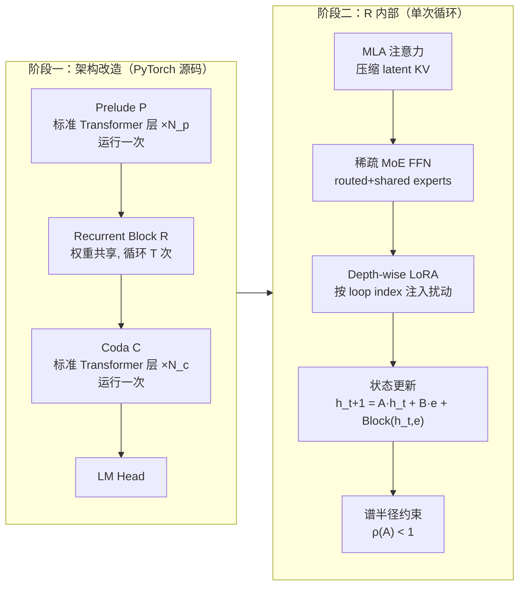
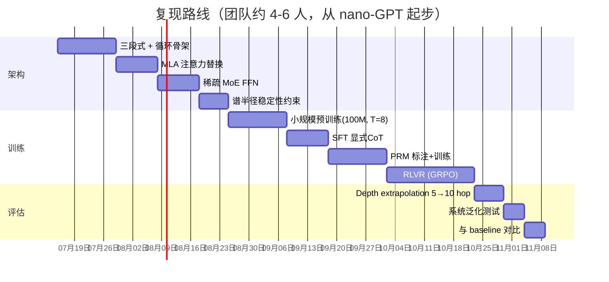

## 一、逆向证据盘点：哪些能查到，哪些是推测
| 证据维度 | 来源 | 可信度 | 关键结论 |
|---|---|---|---|
| OpenMythos 项目结构（Prelude→Recurrent→Coda 三段式） | GitHub README | 中（社区重建，非官方） | Fable 5 疑似是 RDT：一组层权重共享并循环 T 次，在单次前向里完成"隐式思考" |
| 循环更新公式 `h_{t+1}=A·h_t+B·e+Transformer(h_t,e)` | OpenMythos README | 中 | 输入注入 `e` 每轮都注入，防止漂移；A、B 是可学习注入参数 |
| 谱半径稳定性约束 `ρ(A)<1` | OpenMythos README | 中 | 用连续负对角参数化 + ZOH/Euler 离散，保证循环不发散 |
| MLA（Multi-Latent Attention, DeepSeek-V2）与 GQA 可切换 | OpenMythos README、BuildThisNow | 中 | 循环模型对 KV-cache 极敏感，MLA 压缩 latent KV 是关键 |
| 稀疏 MoE FFN（routed + shared experts） | OpenMythos README | 中 | 每轮只激活部分专家，控制循环里每步计算量 |
| Depth-wise LoRA（每轮注入小幅扰动） | BuildThisNow | 中 | 让"同一层"在不同 loop 上行为略不同，避免每轮做一模一样的事 |
| Adaptive thinking（唯一思考模式，无 budget，仅 summarized 输出） | Claude 官方文档、Vercel AI Gateway | 高（官方） | Fable 5 的"思考"是 `effort` 参数控制的推理深度，不是传统 extended thinking budget |
| Fable 5 与 Mythos 5 共享权重，仅安全分类器分隔 | Anthropic 官方、Latent.Space | 高（官方） | "循环"是底层架构，与安全层无关 |
| 1M 上下文 / 128K 输出 | Simon Willison | 高（官方） | 与 `mythos_100b+` 变体配置一致 |
| Saunshi et al. 2025：latent loop = 隐式 CoT 的形式化证明 | OpenMythos README 引用 | 高（学术） | 为"循环即思考"提供理论支撑 |
| Grokking 三阶段（记忆→分布内泛化→系统泛化） | arXiv 2604.07822 | 高（学术） | 解释 Fable 5 在新问题上"质变式"聪明 |
**一句话定性**：循环深度 Transformer 这条线在学术界是真实存在且被严肃研究的，OpenMythos 把它对齐到 Fable 5 的行为签名（depth extrapolation、系统泛化、latent CoT）是有逻辑依据的；但"Anthropic 用的就是这套"目前仍是**推测**，没有系统卡白纸黑字写明。下面所有改造方案都建立在这个前提之上。
---
## 二、对照上一版 plan：对在哪、错在哪
| 上一版 plan 的主张 | 逆向证据 | 判定 |
|---|---|---|
| 用 Universal Transformer 的"权重共享 + 层间循环" | OpenMythos 三段式 RDT 完全吻合 | ✅ 方向正确 |
| 用 ACT + halting token 做自适应停机 | Fable 5 用的是 `effort` 参数 + adaptive thinking，不是 halting token | ⚠️ 机制猜错：不是 halting head，而是循环次数由 effort 控制 |
| 标准多头 attention | 证据指向 **MLA**（DeepSeek-V2 式 latent KV） | ❌ 应改为 MLA |
| 标准 FFN | 证据指向 **稀疏 MoE（routed+shared experts）** | ❌ 应改为 MoE |
| 循环里每轮行为相同 | 证据指向 **depth-wise LoRA** 让每轮略不同 | ⚠️ 需补 |
| PRM + RLVR 训练 | 与 Anthropic 已知方法论一致，且无矛盾证据 | ✅ 保留 |
| 循环无稳定性约束 | OpenMythos 明确 `ρ(A)<1` 约束 | ❌ 漏了关键工程项，不补会训练发散 |
| 输入只在第一轮注入 | 公式 `h_{t+1}=A·h_t+B·e` 中 `e` 每轮注入 | ❌ 应改为每轮注入 |
**结论**：上一版 plan 大方向对（RDT + RLVR），但**注意力机制、FFN、稳定性约束、自适应控制方式**四项都需要修正。下面给修正版。
---
## 三、修正后的论文清单（按改造阶段排序）
| 阶段 | 论文 | 解决什么问题 |
|---|---|---|
| ① 循环骨架 | Universal Transformers (Dehghani et al., 2018) | 权重共享 + 层间循环的原始范式 |
| ② 自适应深度 | Adaptive Computation Time (Graves, 2016) | 推理时动态决定循环次数（对应 Fable 5 的 `effort`） |
| ③ 隐式推理理论 | Saunshi et al., 2025 — "Latent Thoughts as Implicit CoT" | 证明 latent loop 等价于 CoT，为"循环即思考"奠基 |
| ④ 系统泛化 & 深度外推 | "Loop, Think, & Generalize" (arXiv:2604.07822) | 解释 grokking 三阶段与 depth extrapolation |
| ⑤ MLA 注意力 | DeepSeek-V2 技术报告 | 循环场景下压缩 KV-cache 的关键 |
| ⑥ GQA / Flash-Attn2 | Ainslie et al. 2023；Dao et al. 2023 | 备选注意力 + I/O 最优实现 |
| ⑦ 稀疏 MoE | Switch Transformer (Fedus et al., 2022)；DeepSeek-V3（shared+router experts） | 每轮只激活子集，控制循环计算量 |
| ⑧ Depth-wise LoRA | LoRA (Hu et al., 2021) + 循环专用变体 | 让同一层在不同 loop 行为略不同 |
| ⑨ 循环稳定性 | HiPPO/LMU 线性循环算子；"Looped Transformer"稳定性文献 | `ρ(A)<1` 谱半径约束，防残差爆炸 |
| ⑩ PRM 训练 | "Let's Verify Step by Step" (Lightman et al., OpenAI, 2023) | 过程级奖励，奖励"每轮循环的验证质量" |
| ⑪ RLVR | DeepSeekMath/GRPO (Shao et al., 2024)；o1-style RL | 可验证奖励的强化学习，逼模型学会"用循环纠错" |
| ⑫ SFT 思维链蒸馏 | "STaR" (Zelikman et al., 2022)；"Self-Taught Reasoner" | 把显式 CoT 蒸馏成隐式 latent loop |
---
## 四、修正后的 Transformer 改造 plan
### 4.1 架构总览

### 4.2 关键源码改造点（基于 nano-GPT / PyTorch 参考实现）
**改造点 1：把 `nn.Sequential` 的层堆叠改成三段式 + 循环**
```python
# 原版：layers = nn.ModuleList([Block(cfg) for _ in range(n_layer)])
# 改造：
class MythosModel(nn.Module):
    def __init__(self, cfg):
        self.prelude  = nn.ModuleList([Block(cfg) for _ in range(cfg.prelude_layers)])
        self.recurrent = RecurrentBlock(cfg)   # 权重共享,循环 max_loop_iters 次
        self.coda     = nn.ModuleList([Block(cfg) for _ in range(cfg.coda_layers)])
        self.lm_head  = nn.Linear(cfg.dim, cfg.vocab_size, bias=False)
    def forward(self, ids, n_loops=None):
        h = self.embed(ids)
        e = self.prelude_forward(h)            # e 作为"输入注入"信号
        h = self.recurrent(h, e, n_loops=n_loops or cfg.max_loop_iters)
        h = self.coda_forward(h)
        return self.lm_head(h)
```
**改造点 2：循环块内部 + 每轮输入注入 + 谱半径约束**
```python
class RecurrentBlock(nn.Module):
    def __init__(self, cfg):
        self.block = Block(cfg)               # 唯一一份权重
        self.A = nn.Parameter(... )            # 注入参数,参数化为负对角
        self.B = nn.Parameter(...)
        self.lora_per_loop = DepthWiseLoRA(cfg, n_loops=cfg.max_loop_iters)
    def forward(self, h, e, n_loops):
        for t in range(n_loops):
            delta = self.block(h, e)          # Transformer(h_t, e)
            delta = delta + self.lora_per_loop(t, h)  # 每轮略不同
            h = self.stable_update(h, e, delta)      # h = A·h + B·e + delta
        return h
    def stable_update(self, h, e, delta):
        # ρ(A)<1 约束:把 A 参数化为 exp(-softplus(diag_raw)) 的负对角
        A = -torch.diag(torch.softplus(self.A_diag_raw))   # 保证收敛
        return A @ h + self.B @ e + delta
```
**改造点 3：MLA 替换标准 MHA**（关键，否则循环时 KV-cache 爆炸）
```python
class MultiLatentAttention(nn.Module):
    # DeepSeek-V2 式:缓存压缩后的 latent KV,而非完整 K/V
    def forward(self, x):
        kv_latent = self.kv_lora_proj(x)          # 压到 kv_lora_rank 维
        # 拆 RoPE / no-RoPE head dim,避免缓存重旋转
        ...
```
**改造点 4：稀疏 MoE FFN 替换标准 MLP**
```python
class MoEFFN(nn.Module):
    def __init__(self, cfg):
        self.router     = nn.Linear(cfg.dim, cfg.n_experts, bias=False)
        self.experts    = nn.ModuleList([Expert(cfg) for _ in range(cfg.n_experts)])
        self.shared     = Expert(cfg)             # 共享专家,必激活
    def forward(self, x):
        gate = self.router(x)
        topk_idx, topk_w = self.topk_gating(gate, k=cfg.n_experts_per_tok)
        out = self.shared(x)                      # shared 全开
        for i, idx in enumerate(topk_idx):
            out += topk_w[i] * self.experts[idx](x)
        return out
```
**改造点 5：自适应深度（替代 ACT halting token）**
```python
# Fable 5 行为:用 effort 参数控制 n_loops,而不是 halting head
def generate(self, ids, effort="high"):
    loop_map = {"low":4, "medium":8, "high":16, "xhigh":32}
    n_loops = loop_map[effort]
    # 注意:训练时 max_loop_iters 要 ≥ 推理最大值,否则 depth extrapolation 失败
    return self.model(ids, n_loops=n_loops)
```
### 4.3 训练范式（SFT + RLVR）
| 阶段 | 方法 | 数据 | 目标 |
|---|---|---|---|
| ① 预训练 | 标准 LM loss，但**训练时循环次数也要变**（uniform sample T∈[1,T_max]） | FineWeb-Edu 10B~30B tokens | 让循环算子收敛，谱半径稳定 |
| ② SFT 显式 CoT | SFT on 带显式验证步骤的轨迹 | 自建代码/数学题集 | 让循环块学会"生成验证→执行→纠错"的 latent 对应 |
| ③ PRM | Lightman et al. 过程奖励模型 | 标注每轮循环的中间质量 | 奖励"每轮循环都在推进验证"而非只看终答 |
| ④ RLVR | GRPO/PPO，reward = 可验证正确性 + 过程奖励 | 带可验证答案的题（代码执行、数学、单元测试） | 逼模型学会"用更多循环纠错" |
| ⑤ 蒸馏 | STaR 式迭代 | 把 o1/o3 的显式 CoT 蒸馏进 latent loop | 让 latent thought 与显式 thought 行为对齐 |
### 4.4 工程坑位 + 复现路线图

### 4.5 风险评估表
| 风险 | 触发条件 | 缓解方案 |
|---|---|---|
| 训练发散（残差爆炸） | `ρ(A)≥1` | 参数化 A 为负对角 + ZOH 离散 + 训练时监控 `torch.linalg.eigvals(A).abs().max()` |
| Depth extrapolation 失败 | 训练 T=5，推理 T=10 直接崩 | 训练时 T 在 [1,T_max] 均匀采样，让模型见过所有深度 |
| KV-cache 在 MLA 上仍爆 | 循环 × 长上下文 | 强制 MLA + RoPE/非RoPE 拆分 head，避免重旋转 |
| MoE 路由崩溃 | 某专家被长期冷落 | 辅助 loss + 负载均衡 + shared expert 兜底 |
| 循环行为同质化 | depth-wise LoRA rank 太小 | 调大 `lora_rank`，或改成 loop-conditioned MLP 注入 |
| RLVR reward hacking | 模型学会"假验证通过" | 用**独立外部验证器**（真实执行单元测试），不信任模型自报 |
| 与真实 Fable 5 不符 | OpenMythos 本身是推测 | 在公开能力维度（depth extrapolation、系统泛化）上对齐行为签名，而非追求权重一致 |
---
## 五、一句话收尾
**可查证的硬证据**：Fable 5 用 adaptive thinking（无 budget、仅 summarized 输出）、与 Mythos 5 共享权重、1M 上下文；**强推测但非官方**：它底层是循环深度 Transformer（Prelude-Recurrent-Coda 三段、MLA 注意力、稀疏 MoE、depth-wise LoRA、谱半径稳定化），这套重建来自 OpenMythos 社区项目及其引用的学术论文。
按照修正后的 plan 走，最关键的改动是：**把"标准 attention + halting token"换成"MLA + effort 控制的固定/采样循环次数"，并补上谱半径稳定性约束**——这两点上一版 plan 猜错了，是逆向证据里最硬的部分。建议先拿 OpenMythos 的 `mythos_1b` 配置在 FineWeb-Edu 上跑通 30B tokens 的预训练，再接 SFT+PRM+RLVR，以行为签名（而非权重）对齐 Fable 5。
